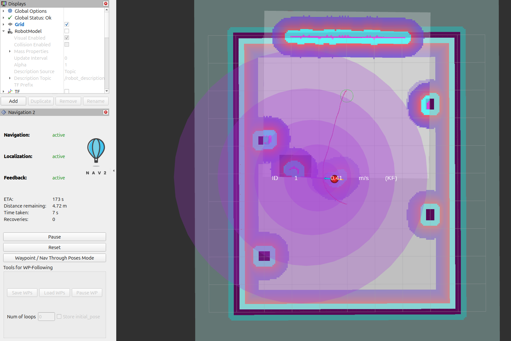
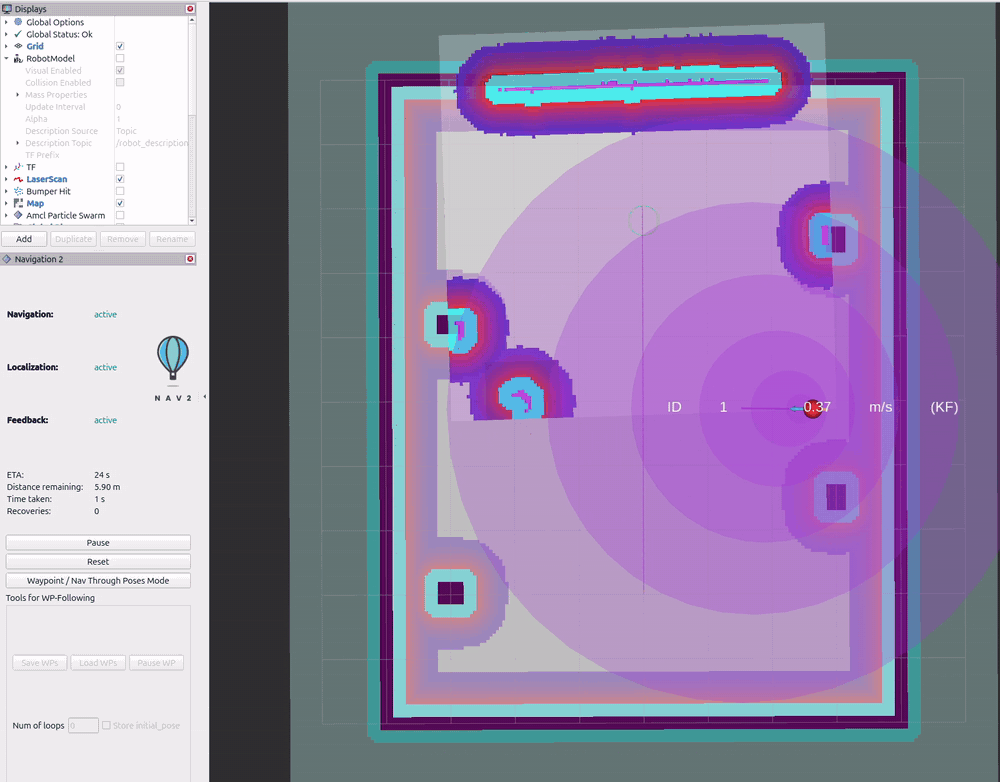
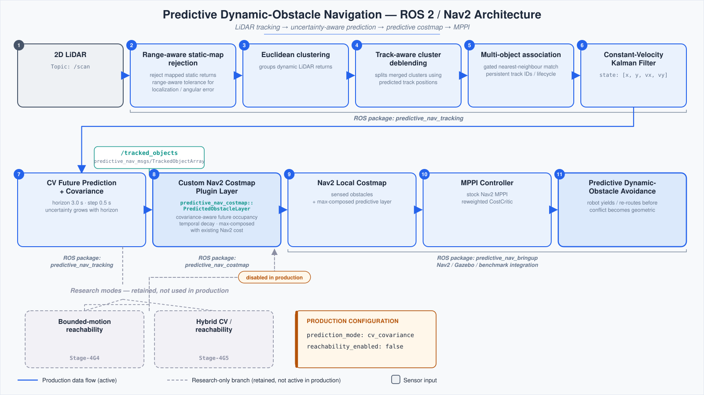
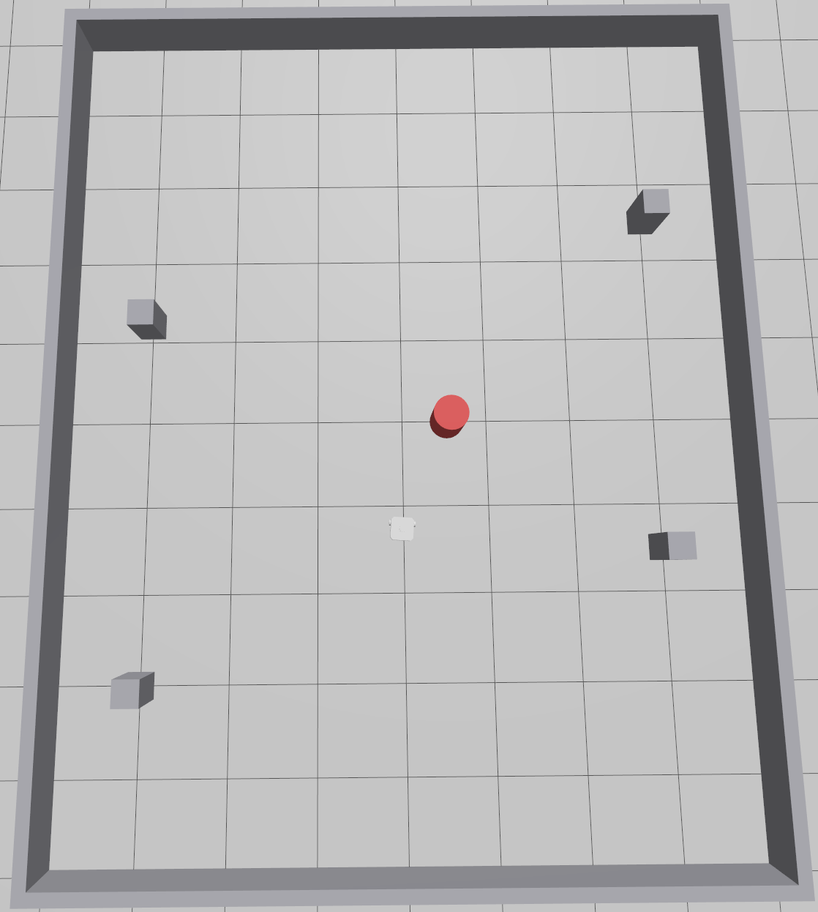

# Predictive Dynamic-Obstacle Navigation for ROS 2 / Nav2

A ROS 2 Jazzy / Nav2 navigation stack that tracks moving obstacles from 2D
LiDAR, predicts their short-horizon future motion, and feeds that prediction
into a custom Nav2 costmap layer so an MPPI controller can react **before**
a conflict is geometrically unavoidable rather than after it becomes visible
to ordinary reactive sensing.

The project has been through a staged Gazebo simulation validation campaign
(`validation/STAGE4*_README.md`) culminating in a 448-trial final robustness
pass, and is frozen at tag `predictive-nav-v1.0`. Every number in this
README is taken directly from that validation evidence — see
[Validation & Evidence](#validation--evidence) for exactly where.



*RViz view of the production CV-predictive navigation stack: tracked obstacle ID and Kalman velocity estimate, future uncertainty corridor, and the resulting Nav2 avoidance trajectory.*

## Why this exists

Reactive obstacle avoidance only sees a moving obstacle once it enters
sensing range, so its warning *time* shrinks as the obstacle speeds up. This
project instead tracks each obstacle with a per-object Kalman filter,
propagates its state forward under a constant-velocity model, and paints
that predicted trajectory — with growing positional uncertainty — into the
local costmap as a soft, time-decaying cost region. MPPI then plans against
where the obstacle *will be*, not just where it *was last seen*.

The headline result (Stage-4F, wide open arena, 120 trials): mean minimum
clearance improves **5–6×** at crossing speeds of 0.50–0.75 m/s (0.133 m →
0.795 m; 0.159 m → 0.783 m), reaction happens **0.76–2.92 s** earlier, and
**6 reactive collisions become 0** predictive collisions, with comparable
navigation time.

## Demo



*Predictive perpendicular-crossing trial using the production CV configuration. The tracker estimates the moving obstacle state with a Kalman filter, propagates its future motion and uncertainty into the predictive costmap, and Nav2 MPPI adjusts the robot trajectory before the crossing conflict.*

## System architecture



*Production ROS 2 / Nav2 pipeline: LiDAR tracking and CV prediction feed future obstacle occupancy through a custom costmap layer into the stock Nav2 MPPI controller. Reachability-based modes are retained only as research variants.*

Everything above the costmap layer runs as a standalone C++ tracker node
(`predictive_nav_tracking`) publishing `predictive_nav_msgs/TrackedObjectArray`
at scan rate; the costmap layer and MPPI are stock Nav2 machinery with one
custom `nav2_costmap_2d` plugin. No Nav2 or MPPI source was modified —
prediction enters the stack purely as an additional costmap layer and a
reweighted stock critic parameter.

## ROS 2 package structure

| Package | Type | Role |
|---|---|---|
| [`predictive_nav_msgs`](src/predictive_nav_msgs) | `ament_cmake` (rosidl) | `TrackedObject`, `TrackedObjectArray`, `TrackedObjectPrediction`, `ReachabilityPrediction` message definitions |
| [`predictive_nav_tracking`](src/predictive_nav_tracking) | `ament_cmake` (C++) | `lidar_obstacle_tracker_node`: static rejection → clustering → deblending → association → Kalman filter → CV prediction → (optional) reachability sets |
| [`predictive_nav_costmap`](src/predictive_nav_costmap) | `ament_cmake` (C++, pluginlib) | `PredictedObstacleLayer`, a `nav2_costmap_2d` plugin that turns tracked-object predictions into costmap cost |
| [`predictive_nav_bringup`](src/predictive_nav_bringup) | `ament_cmake` | Launch files, Nav2/AMCL/MPPI parameter files, Gazebo worlds/maps, RViz configs, and every benchmark/evaluation script used to produce `validation/` |

## Main technical features

- **Range-aware static-map rejection** (Stage-4G1) — the static-rejection
  radius grows with measurement range to absorb localisation-yaw-induced
  beam drift, instead of a single fixed radius that starts admitting wall
  returns as false dynamic tracks at long range.
- **Track-aware cluster deblending** (Stage-4G3) — two obstacles that fall
  into one connected-component cluster are split using the tracker's own
  Kalman-predicted positions as seeds, with thresholds measured from 1,197
  recorded frames rather than assumed from a nominal obstacle size.
- **Per-track constant-velocity Kalman filter** (Stage-4C) with a raw
  finite-difference measurement retained on every track for direct
  RAW-vs-KALMAN comparison.
- **Uncertainty-aware predictive costmap layer** (Stage-4D) — a custom
  `nav2_costmap_2d::Layer` plugin that paints predicted future occupancy as
  a soft, time-decaying, radius-bounded cost region, combined via
  `updateWithMax` so it can only add cost on top of sensed geometry, never
  replace it, and is capped below `INSCRIBED_INFLATED_OBSTACLE` so a
  prediction is never asserted as a sensed lethal obstacle.
- **Two additional research-only prediction modes**, implemented, tested,
  and retained but not shipped in production: a conservative bounded-motion
  **reachability** model (Stage-4G4, a conservative outer bound under the
  declared acceleration/speed motion assumptions — 3,000 adversarial
  trajectories contained with 0.000 m worst-case slack) and a **hybrid**
  CV/reachability coasting policy (Stage-4G5) that falls back to
  reachability only while a track's observation is stale.
- **Machine-generated, reproducible benchmarking** — every table in
  `validation/` is produced by a checked-in analysis script from raw trial
  logs; nothing is transcribed by hand.

## Production configuration

The system ships with prediction fixed to **CV-only** after three dedicated
decision stages (Stage-4G5/4G6/4G7 — see
[Why CV-only was selected](#why-cv-only-was-selected)):

```yaml
# src/predictive_nav_bringup/config/production_nav2_params.yaml
local_costmap:
  local_costmap:
    ros__parameters:
      predicted_obstacle_layer:
        prediction_mode: "cv_covariance"   # stated explicitly, not inherited
        enabled: True
        max_prediction_horizon: 3.0
        sigma_level: 1.5
        temporal_decay: 0.35
        max_cost: 250
        min_cost: 0
        max_influence_radius: 0.55
```

```yaml
# src/predictive_nav_tracking/config/production_tracker_params.yaml
lidar_obstacle_tracker:
  ros__parameters:
    reachability_enabled: false        # the only change from tracker_params.yaml
```

These two files are derived from the validated `nav2_stage4f_params.yaml`
and `tracker_params.yaml` by exactly one explicit change each — nothing else
in the MPPI configuration, planner, inflation, voxel layer, velocity limits,
collision monitor, or AMCL setup differs. `stage4g4_reachability` asserts
`cv_prediction_bit_identical` with `reachability_enabled` in either state, so
disabling it changes nothing about the CV prediction that ships; it only
removes the 0.35–0.98 ms/scan cost of computing a field no production
consumer reads.

## Selected reactive-vs-predictive results

Wide-arena benchmark, Stage-4F, 10 reactive + 10 predictive trials per
condition (`validation/STAGE4F_README.md` §5–6):

| condition | reactive clearance | predictive clearance | reactive collisions | predictive collisions | reaction lead |
|---|---:|---:|---:|---:|---:|
| perpendicular crossing, 0.50 m/s | 0.133 ± 0.037 m | **0.795 ± 0.020 m** | 0 | 0 | **1.90 s** |
| perpendicular crossing, 0.75 m/s | 0.159 ± 0.035 m | **0.783 ± 0.020 m** | 0 | 0 | **1.93 s** |
| oblique crossing | 0.121 ± 0.025 m | **0.629 ± 0.010 m** | 0 | 0 | **2.92 s** |
| head-on | −0.010 ± 0.117 m | **0.141 ± 0.031 m** | **6** | **0** | **1.28 s** |
| no-conflict control | 1.136 ± 0.013 m | 1.145 ± 0.014 m | 0 | 0 | n/a (no reaction difference) |

Final robustness pass, Stage-4G8, production configuration
(`validation/STAGE4G8_README.md` §12):

| scenario | reactive clearance | CV-predictive clearance | reaction lead |
|---|---:|---:|---:|
| perpendicular crossing | 0.112 m | **0.812 m (7.3×)** | 2.30 s |
| reversal (obstacle reverses toward robot) | −0.176 m, **10/10 collisions** | **0.725 m, 0/9 collisions** | 2.49 s |
| blind-corner world | 0.412 m | **0.945 m (2.3×)** | 2.14 s |

The no-conflict control matters as much as the positive results: with the
obstacle visible, tracked, and predicted throughout but never on a collision
course, navigation time differs by **9 ms** and path length by **10 mm**
between arms — the predictive layer detects a specific conflict, it does not
penalise every tracked object generically.

<p align="center">
  
</p>

*Gazebo simulation environment used for dynamic-obstacle navigation and robustness validation.*

## Robustness validation summary

Stage-4G8 ran **448 trials across 46 condition groups** against the frozen
production configuration: obstacle-speed sweep, encounter-timing sweep,
sensor-noise injection, localisation-error injection, a geometry-rich
(blind-corner) world, multi-object scenes, brief occlusion, and seeded
randomised perturbation. Verdict: **PASS WITH LIMITATION** — the system
reproduces its validated nominal behaviour, degrades gracefully outside it,
and every observed failure traces to a physical or sensing limit (listed
below), not to a defect in clustering, association, the Kalman/CV model, or
the costmap layer.

| check | result |
|---|---|
| Nominal Stage-4F/4G behaviour reproduced under production config | PASS (within ±0.05 m of recorded references) |
| Obstacle speed 0.15–0.75 m/s | 0 collisions, clearance ≥ 0.66 m, lead ≥ 1.68 s |
| Obstacle speed 1.00 m/s | 0 collisions, but worst clearance 0.028 m, lead 0.76 s — margin effectively gone |
| Encounter timing, −1.5 s … +1.0 s window | 0 collisions, clearance ≥ 0.587 m |
| Sensor range noise ≤ 0.06 m | tracking metrics unmoved (0 false tracks) |
| Sensor range noise = 0.10 m | exceeds the 0.15 m static-rejection radius → 80 false-confirmed, 35 false-persistent tracks; navigation stayed collision-free |
| Localisation offset ≤ 0.15 m / 0.10 rad | 1 false-persistent track |
| Localisation offset ≥ 0.30 m / 0.20 rad | 69–73 false-persistent tracks; navigation stayed collision-free in all 30 trials |
| Multi-object (2–3 tracks) | 0 ID switches, purity 1.000, 100% costmap multi-representation |
| 150 s endurance run, 3 obstacles | 9,642 predictions checked, 0 mathematical failures, no lifecycle/deadlock issues |
| Regression suite (6 unit tests + 4 evaluator tests) | all PASS, including the research-mode reachability/hybrid tests |

Full per-condition data: [`validation/stage4g8/results.csv`](validation/stage4g8/results.csv)
and [`validation/stage4g8/results.json`](validation/stage4g8/results.json)
(46 scored rows plus 8 retained setup-failure records).

## Why CV-only was selected

Three dedicated stages tested whether the reachability/hybrid research
policy earns a place in production, each looking harder for a benefit than
the last:

1. **Stage-4G6** (365 trials, open room, moving occluder) — CV and Hybrid
   were indistinguishable on every navigation metric pooled over 97/99
   in-gap trials. The one nominal "win" (`g6_s04_cv`) rested on 2 of 30
   trials, **failed a designed replication**, and its mechanism turned out
   to be an indirect path perturbation via a *different*, continuously
   visible obstacle — not better prediction of the occluded one.
2. **Stage-4G7** (282 trials, purpose-built blind-corner worlds) — designed
   to give reachability its best possible chance: static occlusion, the
   occluded target as the clearance-limiting object in **100%** of trials,
   and the largest CV coverage deficit ever measured in the project
   (0.207 → 1.000 coasting coverage for Hybrid). Result: **+0.005 m** mean
   clearance gain, 95% CI **[−0.010, +0.019]** — indistinguishable from
   zero. A pre-registered four-gate decision rule (effect, replication,
   mechanism, cost) failed on effect, replication, and mechanism.
3. **Stage-4G8** confirms the decision holds under production
   configuration and broad perturbation (§10 in that report).

The consistent structural reason (traced, not assumed, in Stage-4G7 §6): a
five-fold improvement in coverage during a brief occlusion does not produce
a measurably different costmap before the object is re-observed, because
the coasting window is only ~4 scans long and the layer's own
`max_influence_radius` already bounds how far any single prediction may
paint. **What this does not say:** reachability provides a conservative outer
bound under its declared acceleration/speed motion assumptions (tight bound,
0.000 m worst-case slack over 3,000 adversarial trajectories), costs
microseconds, and never made navigation worse in any powered
comparison — it is retained, unmodified, as a research mode selectable by
one parameter (`prediction_mode: reachability` / `hybrid`), for a future
domain where occlusion and imminent conflict genuinely coincide (a faster
robot, a longer commitment distance, or an obstacle emerging from occlusion
inside braking distance).

## Build instructions

Target environment: **ROS 2 Jazzy**, Gazebo (`ros_gz_sim`), Ubuntu.

```bash
cd ~/predictive_nav_ws
source /opt/ros/jazzy/setup.bash
rosdep install --from-paths src --ignore-src -r -y
colcon build --symlink-install
source install/setup.bash
```

Packages build in dependency order:
`predictive_nav_msgs` → `predictive_nav_tracking` / `predictive_nav_costmap`
→ `predictive_nav_bringup`.

## Production launch example

```bash
ros2 launch predictive_nav_bringup stage4f_bringup.launch.py \
  params_file:=$(ros2 pkg prefix predictive_nav_bringup)/share/predictive_nav_bringup/config/production_nav2_params.yaml \
  tracker_params:=$(ros2 pkg prefix predictive_nav_tracking)/share/predictive_nav_tracking/config/production_tracker_params.yaml
```

This launches the validated wide-arena world with Nav2, AMCL, the LiDAR
obstacle tracker, and the predictive costmap layer under the exact frozen
production configuration (`prediction_mode: cv_covariance`,
`reachability_enabled: false`). Add `headless:=False use_rviz:=True` to
watch it live, including predicted trajectories and uncertainty ellipses.

## Validation & tag history

| tag | commit | what it certifies |
|---|---|---|
| `stage4f-validated` | `d64f091` | Wide-arena reactive-vs-predictive benchmark validated (120 trials) |
| `stage4g5-hybrid` | `7cb0e09` | Hybrid CV/reachability coasting policy implemented and unit-tested |
| `stage4g6-decision` | `589c8bb` | First KEEP/REMOVE decision benchmark for reachability (365 trials) |
| `stage4g7-cv-final` | `adfabc7` | Final CV-only production decision, blind-corner occlusion (282 trials) |
| `predictive-nav-v1.0` | `d14147d` | **Final validated system** — Stage-4G8 robustness pass (448 trials), production configuration frozen |

Every stage report lives in `validation/` and is self-contained, with an
exact reproduction recipe, machine-generated tables, and a "Known
limitations" section: [`STAGE4C`](validation/STAGE4C_README.md) ·
[`STAGE4D`](validation/STAGE4D_README.md) ·
[`STAGE4E`](validation/STAGE4E_README.md) ·
[`STAGE4F`](validation/STAGE4F_README.md) ·
[`STAGE4G1`](validation/STAGE4G1_README.md) ·
[`STAGE4G2`](validation/STAGE4G2_README.md) ·
[`STAGE4G3`](validation/STAGE4G3_README.md) ·
[`STAGE4G4`](validation/STAGE4G4_README.md) ·
[`STAGE4G5`](validation/STAGE4G5_README.md) ·
[`STAGE4G6`](validation/STAGE4G6_README.md) ·
[`STAGE4G7`](validation/STAGE4G7_README.md) ·
[`STAGE4G8`](validation/STAGE4G8_README.md).
Raw per-trial data, plots, and provenance files (commit hashes, byte-diff
checks against earlier validated stages) sit alongside each report.

## Known limitations / validated operating envelope

Stated plainly, from the Stage-4G8 freeze recommendation:

- **Obstacle speed:** validated up to **0.75 m/s**. At 1.00 m/s the system
  remains collision-free but the safety margin is effectively gone (worst
  clearance 0.028 m, reaction lead 0.76 s) — a reaction-time limit, not a
  perception failure.
- **Localisation error:** static-map rejection degrades above **~0.30 m /
  0.20 rad** of pose error — walls begin generating false dynamic tracks.
  Navigation stayed collision-free in every perturbed trial because the
  false tracks sit near walls, off-route, and only add conservative cost,
  but this is the main operational caveat to carry into a new environment.
- **Sensor noise:** tracker metrics are essentially unaffected up to
  **0.06 m** of added range noise; above **0.10 m** the noise exceeds the
  static-rejection radius and produces the same false-track effect as
  localisation error.
- **Brief occlusion:** CV coasting coverage of a temporarily hidden object
  is poor (0.207 at 0.5 s under static occlusion, Stage-4G7) — a known,
  deliberately accepted limitation of shipping CV-only. It reduces margin
  (worst clearance 0.110 m observed) but did not cause a collision in any
  validated trial, and reachability/hybrid do not measurably fix it in this
  domain (see [Why CV-only was selected](#why-cv-only-was-selected)).
- **Time-agnostic costmap:** the predictive layer paints the whole swept
  future corridor at once; MPPI cannot reason "I will be there after the
  obstacle has passed," so the controller always yields on a pure
  perpendicular crossing rather than timing a pass-behind. A time-parameterised
  costing scheme would need a custom critic, which was deliberately not
  written.
- **Never-observed obstacles:** neither CV nor reachability can predict an
  object that has never been tracked — both are propagations of a filter
  state that does not yet exist. This is a perception limit, not something
  any prediction policy can compensate for.
- **Scope of validation:** one robot, one 5 Hz planar LiDAR, one arena
  family (10 × 8 m open room plus purpose-built blind-corner variants),
  Gazebo simulation only. Head-on and multi-object *converging* stress
  scenarios (invented for Stage-4G8 specifically to map the failure
  envelope) provided no viable escape corridor in the tested setup — these
  are reported as the envelope's edge, not as regressions.

## Project status

**Frozen at `predictive-nav-v1.0`.** The prediction-policy question is
closed for the domains this project can construct: CV-only covariance
prediction is the production configuration; bounded-motion reachability and
the CV/reachability hybrid policy remain in the tree, fully implemented and
regression-tested, selectable via `prediction_mode` for future domains where
occlusion and imminent conflict genuinely coincide. No further algorithm
stage is planned; a next stage would need a new *domain* (faster robot,
longer commitment distance, camera perception for earlier detection), not a
new predictor.
